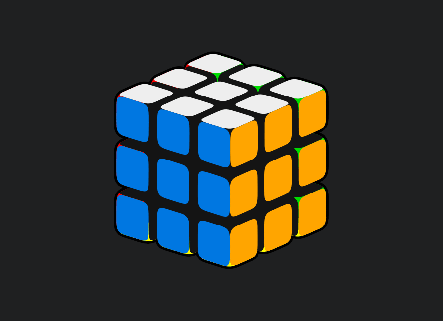

# Rubik's Cube Solver





Welcome to the Rubik's Cube Solver project! This solver is designed to tackle one of the world's most iconic puzzles, the Rubik's Cube, using Richard Korf's Iterative Deepening A* (IDA*) algorithm. Whether you're a seasoned cube enthusiast or a beginner, this tool will help you conquer the challenge and unravel the mysteries of the cube.


## Table of Contents

- [Rubik's Cube Solver](#rubiks-cube-solver)
  - [Table of Contents](#table-of-contents)
  - [Introduction](#introduction)
  - [Features](#features)
  - [Getting Started](#getting-started)
  - [Algorithm Overview](#algorithm-overview)
  - [Contributing](#contributing)
  - [License](#license)


## Introduction

The Rubik's Cube has captivated minds for decades with its mesmerizing complexity. Solving it can be a daunting task, especially for more intricate cube configurations. Our project aims to simplify this process by harnessing the power of Richard Korf's IDA* algorithm, renowned for its efficiency in solving puzzles with vast state spaces.


## Features

- **IDA* Algorithm**: Our solver is built around Korf's IDA* algorithm, a memory-efficient and effective method for finding optimal solutions to the Rubik's Cube.

- **Interactive Interface**: Enjoy a user-friendly command-line interface that allows easy input and manipulation of your Rubik's Cube configuration.

- **Customizable**: Tailor the solving process to your needs by configuring various parameters, including the maximum depth limit and heuristic functions.

- **Optimal Solutions**: Rest assured that our solver will find the optimal solution for your Rubik's Cube, minimizing the number of moves required.

- **Step-by-Step Visualization**: Visualize the solution step by step, gaining a deeper understanding of the solving process.


## Getting Started

To get started with the Rubik's Cube Solver, follow these simple steps:


1. **Clone the Repository**:
   ```bash
   git clone https://github.com/Ankan-Nayak/rubiks-cube-solver.git
   ```

2. **Build the Project**:
   - Open the project in CLion IDE.
   - Configure the CMake settings according to your system.
   - Build the project using the IDE's build functionality.

3. **Run the Solver**:
   - Open the terminal in CLion IDE.
   - Navigate to the project directory.
   - Run the solver executable generated by the build process.

4. **Enjoy Solving!**:
   - Follow the on-screen instructions to input and manipulate your Rubik's Cube configuration.
   - Let the solver find the optimal solution for you.
   - Visualize the solution step by step for a deeper understanding of the solving process.

## Algorithm Overview
The Rubik's Cube Solver utilizes Richard Korf's Iterative Deepening A* (IDA*) algorithm to find the optimal solution for the Rubik's Cube. IDA* is a memory-efficient and effective method for solving puzzles with vast state spaces. It combines depth-first search with heuristic evaluation to efficiently explore the solution space and find the shortest path to the goal state.

## Contributing
Contributions to the Rubik's Cube Solver project are welcome! If you have any ideas, suggestions, or bug reports, please open an issue or submit a pull request. We appreciate your contributions and strive to make this project as robust and user-friendly as possible.

## License
This project is licensed under the MIT License. See the [LICENSE](LICENSE) file for more details.